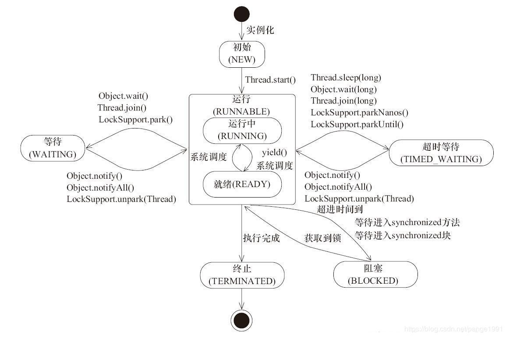

- Thread是对线程的抽象，Runnable是对任务的抽象
- JDK的线程是协作式的，不是中断式的。
- 死锁状态不会被中断。
- start方法启动，仅能执行一次
- run方法算是业务逻辑，不是启动程序本身
- yield()会让出cpu，不会让出锁
- join()在线程中中断执行其他的线程，保证两个线程顺序执行
- 守护线程中的finally不一定执行
- 线程优先级：？？ 2-10 只是优先级较高的线程执行次数较多
- synchronized内置锁，对象锁
- this和对象锁（方法和同步块）
- 类锁和对象锁的区别？？？？
- run方法可以执行多次？ 多次

1. NEW，实现Runable接口和继承Thread可以得到一个线程类，
    new一个实例出来，线程就进入了初始状态。

2. READY，只是资源准备好，没有获得CPU执行权。start进入执行

3. TIMED_WAITING